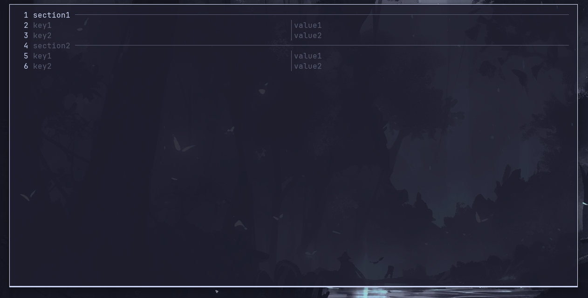

<h1 align="center">sConfig</h1>
<p align="center">A simple config generator/editor</p>

sConfig is a TUI editor for .scf (sOrg Config Format) files\
.scf is similar to the .ini format, embracing simplicity



# Installing

```bash
git clone https://github.com/danilaxila3/sConfig.git
cd sConfig
make
make install
```
